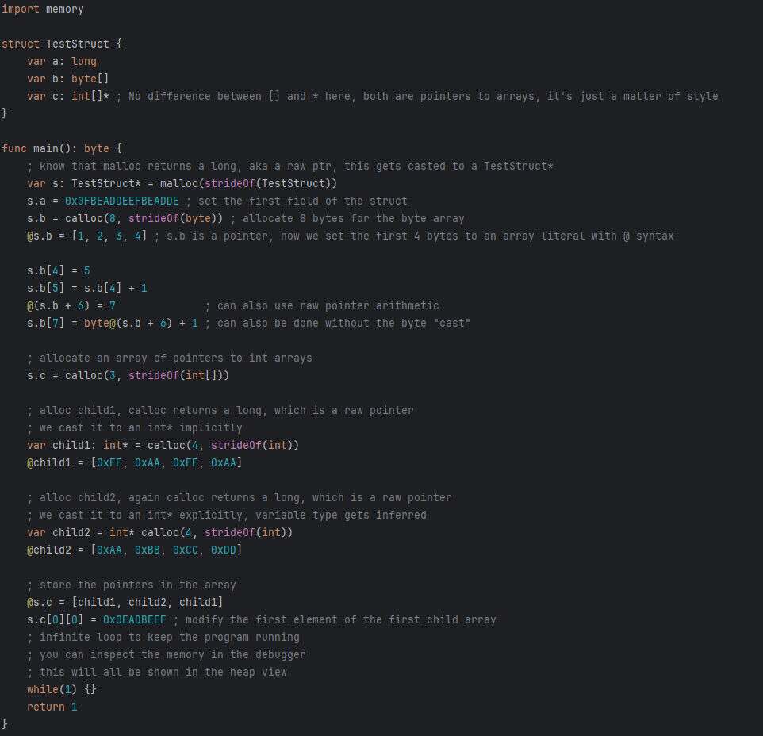
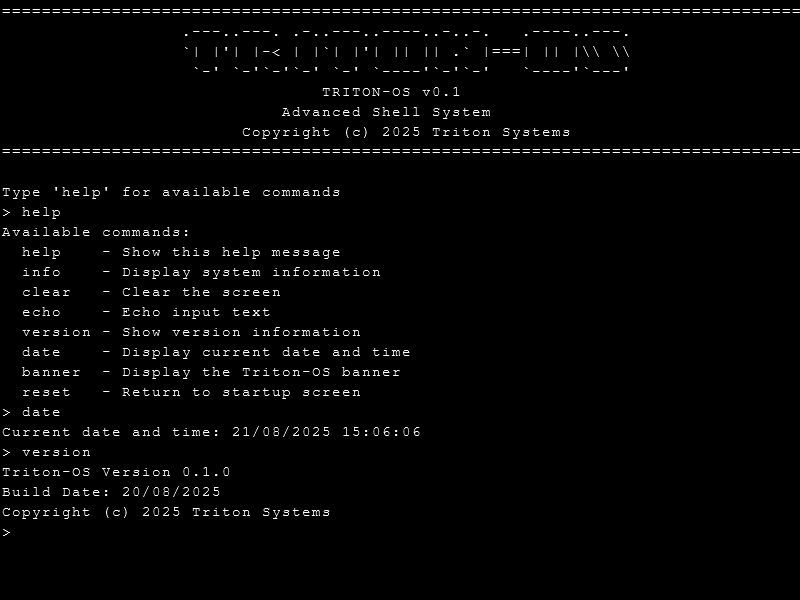

# Triton-64 Virtual Machine

A complete 64-bit virtual machine implementation featuring a custom CPU architecture, assembler, compiler, and development environment built in Java with JavaFX.

## Overview

The Triton-64 VM is a comprehensive virtual machine system that includes:

- **Custom 64-bit CPU Architecture**: Complete instruction set with 32 registers
- **TriC Programming Language + Compiler**: High-level language with optional typing that compiles to Triton-64 assembly
- **Assembler**: Converts assembly code to machine code with macro expansion
- **Memory Management**: Sophisticated memory mapping with ROM, RAM, MMIO, and framebuffer regions
- **Visual Debugging Tools**: Real-time CPU and memory viewers
- **ROM System**: Bootable ROM with integrated assembly code

## Examples





## Architecture

### CPU Specifications

- **Architecture**: 64-bit RISC-style processor
- **Registers**: 32 general-purpose 64-bit registers
- **Instruction Set**: 32-bit fixed-width instructions
- **Memory Model**: Unified 64-bit address space
- **Execution Model**: Sequential execution with conditional jumps

### Register Layout

| Alias | Numeric | Purpose |
| --- | --- | --- |
| `ra` | `r0` | Return address |
| `sp` | `r1` | Stack pointer |
| `fp` | `r2` | Frame pointer |
| `gp` | `r3` | Global pointer |
| `hp` | `r4` | Heap pointer |
| `s0-s9` | `r5-r14` | Saved registers |
| `a0-a6` | `r15-r21` | Argument registers |
| `t0-t8` | `r22-r30` | Temporary registers |
| `t9` | `r31` | **Reserved for assembler use** |

### Memory Layout

```
0x0000_0000_0000_0000  ┌─────────────────┐
                       │      ROM        │  128 KB
0x0000_0000_0002_0000  ├─────────────────┤
                       │      RAM        │  512 MB
0x0000_0000_2002_0000  ├─────────────────┤
                       │      MMIO       │  2 MB
0x0000_0000_2022_0000  ├─────────────────┤
                       │  Framebuffer    │  16 MB
0x0000_0000_2122_0000  └─────────────────┘
```

## Instruction Set Architecture

### Core Instructions

#### Special Operations

- `NOP` - No operation
- `HLT` - Halt CPU execution

#### Data Movement

- `MOV rdest, rsrc` - Copy register value
- `LDI rdest, imm10` - Load 10-bit signed immediate (-512 to +511)
- `LD rdest, rsrc` - Load from memory address
- `ST rdest, rsrc` - Store to memory address

#### Arithmetic Operations

- `ADD rdest, rsrc1, rsrc2` - Addition
- `SUB rdest, rsrc1, rsrc2` - Subtraction
- `MUL rdest, rsrc1, rsrc2` - Multiplication
- `DIV rdest, rsrc1, rsrc2` - Division
- `NEG rdest, rsrc` - Arithmetic negation

#### Bitwise Operations

- `AND rdest, rsrc1, rsrc2` - Bitwise AND
- `OR rdest, rsrc1, rsrc2` - Bitwise OR
- `XOR rdest, rsrc1, rsrc2` - Bitwise XOR
- `NOT rdest, rsrc` - Bitwise NOT
- `SHL rdest, rsrc1, rsrc2` - Logical shift left
- `SHR rdest, rsrc1, rsrc2` - Logical shift right
- `SAR rdest, rsrc1, rsrc2` - Arithmetic shift right

#### Control Flow

- `JMP rdest` - Unconditional jump to register address
- `JZ rdest, rsrc` - Jump if zero
- `JNZ rdest, rsrc` - Jump if not zero
- `JPP rdest, rsrc` - Jump if positive
- `JPN rdest, rsrc` - Jump if negative
- `JAL rdest, rsrc` - Jump and link (store return address)

### Pseudo-Instructions

The assembler provides powerful macro expansions for common operations:

#### Label Operations

```assembly
loop:               ; Define jump target
JMP loop           ; Jump to label (expands to address loading)
JZ loop, r0        ; Conditional jump to label
```

#### Extended Immediate Loading

```assembly
LDI r0, 0x123456789ABCDEF  ; 64-bit immediate (multi-instruction expansion)
LDIU r0, 0x123456789ABCDEF ; Unsafe fast load (clobbers temps)
```

#### Stack Operations

```assembly
PUSH r0, r1, r2    ; Push multiple registers to stack
POP r0, r1, r2     ; Pop multiple registers from stack
```

#### Immediate ALU Operations

```assembly
ADD r0, r1, 42     ; Add immediate (expands to temp + register operation)
SUB r0, r1, 100    ; Subtract immediate
```

## TriC Programming Language

TriC is a high-level programming language designed specifically for the Triton-64 Virtual Machine. It provides a more accessible way to write programs for the VM compared to writing raw assembly code. TriC features a C-like syntax with optional type annotations that primarily affect memory access sizes rather than enforcing type safety.

### Type System

TriC features an optional type system where types mainly guide memory access operations. Unlike strongly-typed languages, TriC allows implicit conversions between all types and does not enforce type safety.

#### Primitive Types

| Type | Size (bytes) | Description |
|------|--------------|-------------|
| `byte` | 1 | 8-bit value |
| `int` | 4 | 32-bit value |
| `long` | 8 | 64-bit value (default type for untyped variables) |

#### Composite Types

- **Pointer Types**: `byte*`, `int*`, `long*` (pointers to specific types)
- **Array Types**: `int[]`, `byte[]`, etc. (alternative for pointers)
- **Function Types**: Defined by return type and parameter types

### Language Features

- **Optional Typing**: Variables can be declared with or without types (default is `long`)
- **Implicit Conversions**: All types can be implicitly converted to any other type
- **Pointer Arithmetic**: Direct memory access with pointer operations
- **Array Syntax**: Arrays are just a different syntax for pointer arithmetic
- **Variables**: Declare and use variables with automatic stack management
- **Functions**: Define functions with parameters and return values
- **Control Flow**: Use `if-else` statements and `while` loops
- **Expressions**: Write complex expressions with arithmetic and logical operators
- **Unlimited Arguments**: Function calls can have any number of arguments (first 7 in registers, rest on stack)
- **Dereferencing**: Access memory locations using the `@` operator
- **Inline Assembly**: Embed raw assembly code within TriC programs

### Syntax Examples

#### Type Declarations and Variables

```tric
var x = 10        ; Untyped (defaults to long)
var y: int = 20   ; Typed as int
var z: byte = 30  ; Typed as byte

var sum = x + y   ; Implicit conversion between types
```

#### Pointer Operations

```tric
var raw = malloc(16)     ; Raw pointer (address stored as long)
int@(raw + 1) = 0xAAAA   ; Store int at offset 1
var value = int@(raw + 1); Load int from offset 1

var p: byte* = malloc(4); Typed pointer
@p = 0xFF                ; Store byte
p[1] = 0xAA              ; Store next byte (equivalent to byte@(p + 1))
var b = p[1]             ; Load byte
```

#### Array Syntax

```tric
var arr: int[] = malloc(32)  ; Array of ints (same as int*)
@arr = [1, 2, 3, 4]          ; Store array literal
arr[2] = 0xDE                ; Store 3rd element (equivalent to int@(arr + 8))
var y = @arr                 ; Load first element (equivalent to int@arr)
arr[4] = y                   ; Store 5th element
```

#### Global Variables

```tric
global g: byte = 67  ; Global variable

func main() {
    var b = 1
    var i: int = 42
    var l = -1
    
    var r = b + g    ; Implicit conversion from byte to long
    r = add1(r)
    
    return r
}

func add1(a) {
    var r = a + 1    ; All operations work with implicit conversions
    return r
}
```

#### Function Definition

```tric
func add(a: int, b: int) {
    return a + b      ; Implicit conversion to return type (long by default)
}
```

#### If-Else Statement

```tric
if (x > y) {
    z = x - y
} else {
    z = y - x
}
```

#### While Loop

```tric
var i = 0
while (i < 10) {
    i = i + 1
}
```

### Type System Characteristics

TriC's type system has several important characteristics to understand:

- **Implicit Conversions**: All types can be implicitly converted to any other type
  ```tric
  var b: byte = 10
  var i = b             ; b is implicitly converted to long
  var b2: byte = i      ; i is implicitly converted to byte (potential data loss)
  ```

- **Array Types Are Pointers**: Array types are purely syntactic sugar
  ```tric
  var arr: int[] = malloc(32)
  ; This is equivalent to:
  var arr: int* = malloc(32)
  ```

- **No Bounds Checking**: Array indexing has no bounds checking
  ```tric
  var arr: byte[] = malloc(4)
  arr[100] = 0xAA  ; This will write to memory beyond the allocated region
  ```

- **No Pointer Safety**: Any pointer can be dereferenced as any type
  ```tric
  var p: int* = malloc(8)
  p[0] = 42
  byte@p = 0xAA  ; This is allowed, even though p was declared as int*
  ```

- **Type Annotations Affect Memory Access**: Types determine the size of memory operations
  ```tric
  var p = malloc(8)
  int@p = 0x12345678  ; 4-byte store
  long@p = 0x12345678 ; 8-byte store (overwrites more memory)
  ```

- **Untyped Variables Default to Long**: Variables without type annotations are treated as `long`
  ```tric
  var x = 10  ; x is a long (64-bit)
  ```

### Compiler Overview

The Tri-C compiler translates TriC source code into Triton-64 assembly code. It consists of several components:

- **Lexer**: Breaks the source code into tokens
- **Parser**: Analyzes the tokens to build an Abstract Syntax Tree (AST)
- **Code Generator**: Traverses the AST to generate assembly code

Key aspects of the compiler:

- **Type Handling**: Uses type annotations to determine memory access sizes, but doesn't enforce type safety
- **Implicit Conversions**: Generates code for all implicit type conversions
- **Register Management**: Efficient allocation of temporary registers
- **Stack Management**: Handles stack frames for functions and local variables
- **Function Calling**: Supports unlimited function arguments (first 7 in registers, rest on stack)

The compiler is designed to be flexible and permissive, allowing the programmer low-level control at the expense of safety.

### Memory Management

TriC provides memory management through:

- **Heap Allocation**: `malloc(size)` returns a pointer to newly allocated memory
- **Stack Allocation**: Local variables are automatically allocated on the stack
- **Type-aware Memory Access**: Type annotations determine the size of memory operations

The compiler handles stack frame management, including:
- Variable storage on the stack
- Parameter passing for function calls
- Return value handling

### Integration with Triton-64 VM

TriC programs are compiled to assembly code, which can then be assembled and run on the Triton-64 VM. The compiler ensures that the generated code adheres to the VM's architecture.

When writing TriC programs, developers should be aware of:

- Untyped variables default to `long` (64-bit)
- Type annotations affect memory access sizes but don't enforce safety
- Arrays are just pointers with different syntax
- Function calls can have unlimited arguments
- All type conversions happen implicitly
- No array bounds checking
- No pointer safety

### Development and Debugging

While developing TriC programs, you can leverage the VM's debugging tools:

- **CPU Viewer**: Monitor register states and program counter
- **Memory Viewer**: Inspect memory contents
- **Type Information**: View how types affect memory operations

The debugging tools help identify issues that might arise from implicit conversions or unsafe memory operations.

### Example TriC Program

Below is a complete TriC program that demonstrates the language's features:

```tric
; Triton-C Feature Showcase
; Demonstrates variables, functions, control flow, and memory operations

global counter = 0
global framebuffer = 0x20220000

; Main program
func main() {
    ; Variable declarations with and without types
    var x = 5
    var y: int = 10
    var z = 0

    ; If-else demonstration
    if (x < y) {
        z = y - x
    } else {
        z = x - y
    }

    ; While loop demonstration
    var i = 0
    while (i < 5) {
        i = i + 1
    }

    ; Function calls
    var fact = factorial(5)  ; 120

    ; Memory operations
    var raw = malloc(16)     ; raw pointer
    int@(raw + 1) = 0xAAAA   ; store int at offset 1
    var value = int@(raw + 1); load int from offset 1

    var p: byte* = malloc(4); typed pointer
    @p = 0xFF                ; store byte
    p[1] = 0xAA              ; store next byte
    var b = p[1]             ; load byte
    @p = "abc"               ; store string literal (byte array)

    var arr: int[] = malloc(32)  ; array of ints
    @arr = [1, 2, 3, 4]          ; store array literal
    arr[2] = 0xDE                ; store 3rd element
    var first = @arr             ; load first element
    arr[4] = first               ; store 5th element

    ; Framebuffer manipulation
    var fb: byte* = framebuffer
    var j = 0
    while (j < 100) {
        fb[j] = counter      ; store byte in framebuffer
        counter = counter + 1
        j = j + 1
    }

    ; Return the total of all operations
    return z + fact + first
}

; Function with return value
func factorial(n) {
    if (n <= 1) {
        return 1
    } else {
        return n * factorial(n - 1)
    }
}
```

This program showcases variable typing (or lack thereof), pointer operations, array syntax, global variables, and unlimited function arguments.

## System Components

### Assembler (`org.lpc.assembler.Assembler`)

The assembler performs sophisticated two-pass assembly:

1. **First Pass**: Symbol resolution and size calculation
2. **Pseudo-instruction Expansion**: Converts macros to native instructions
3. **Second Pass**: Machine code generation

Key features:

- **Symbol Table**: Global label resolution
- **Macro System**: Powerful pseudo-instruction expansion

### Compiler (`org.lpc.compiler.TriCCompiler`)

The Tri-C compiler translates TriC source code into Triton-64 assembly. It follows a compilation pipeline:

1. **Linking**: (**`Linker`**)**: Combines multiple assembly files into a single executable
2. **Lexical Analysis (**`Lexer`**)**: Converts source code into tokens
3. **Parsing (**`Parser`**)**: Constructs an Abstract Syntax Tree (AST)
4. **Code Generation (**`CodeGenerator`**)**: Walks the AST to emit assembly code

Key features of the compiler:

- **Optional Type Handling**: Uses type annotations for memory access sizing
- **Implicit Conversions**: Handles all type conversions automatically
- **Register Management**: Efficient allocation of temporary registers
- **Stack Management**: Handles stack frames for functions
- **Unlimited Arguments**: Supports any number of function arguments
- **Memory Operations**: Generates appropriate load/store instructions based on types

### Memory System (`org.lpc.memory.Memory`)

Sophisticated memory management with:

- **Region Protection**: ROM write protection
- **Address Validation**: Bounds checking for all accesses
- **Endianness Handling**: Little-endian byte ordering
- **MMIO Support**: Memory-mapped I/O simulation

### CPU (`org.lpc.cpu.Cpu`)

The CPU core provides:

- **Instruction Execution**: Full ISA implementation
- **Register Management**: 32 64-bit general-purpose registers
- **Control Flow**: Program counter management with jumps

## Development Tools

### Visual Debuggers

The system includes JavaFX-based debugging tools:

#### CPU Viewer (`org.lpc.visual.CpuViewer`)

- Real-time register display
- Program counter tracking
- Execution status monitoring

#### Memory Viewer (`org.lpc.visual.MemoryViewer`)

- Memory region visualization
- Hexadecimal dump display
- Address-based navigation
- Real-time memory updates

#### Text Mode Viewer (`org.lpc.visual.TextModeViewer`)

- Visualizes the framebuffer as text characters

#### Pixel Mode Viewer (`org.lpc.visual.PixelModeViewer`)

- Visualizes the framebuffer as pixels

### ROM Development (`org.lpc.rom.RomDumper`)

The ROM system allows bootable code development:

1. Write assembly code in `rom.asm`
2. Run `RomDumper` to generate `ROMData.java`
3. Boot ROM code executes automatically on VM startup

## Usage Examples

### Basic Assembly Program

```assembly
main:
    LDI r0, 42          ; Load immediate value
    LDI r1, 58          ; Load another value
    ADD r2, r0, r1      ; Add them together
    HLT                 ; Halt execution
```

### Using Pseudo-Instructions

```assembly
main:
    LDI r0, 0x123456789ABCDEF   ; 64-bit immediate load
    PUSH r0, r1, r2             ; Save registers
    
    ; ... some computation ...
    
    POP r0, r1, r2              ; Restore registers
    JMP return_label            ; Jump to label

return_label:
    HLT
```

### Stack Operations

```assembly
main:
    LDI sp, 0x20000000          ; Initialize stack pointer
    
    ; Push values onto stack
    LDI r0, 100
    PUSH r0
    
    ; Call function
    JAL function_addr, ra
    
    ; Pop result
    POP r1
    HLT

function_addr:
    ; Function implementation
    ; Return address is in ra
    JMP ra
```

## Features and Capabilities

### Advanced Assembler Features

- **Intelligent Macro Expansion**: Pseudo-instructions expand to optimal native instruction sequences
- **Temporary Register Management**: Automatic use of temps for complex operations
- **Symbol Resolution**: Forward and backward label references

### Type System Features

- **Optional Typing**: Types are hints for memory access sizes
- **Implicit Conversions**: All types can be implicitly converted
- **Array-Pointer Equivalence**: Array types are syntactic sugar for pointers
- **Unlimited Function Arguments**: First 7 arguments in registers, rest on stack
- **No Safety Checks**: No array bounds checking or pointer safety

### Debugging Support

- **Real-time Visualization**: Live updates of CPU and memory state
- **Memory Inspection**: Detailed memory region analysis

## Technical Specifications

### Instruction Encoding

Instructions use a 32-bit fixed-width format:

```
31    27 26    22 21    17 16    12 11     7 6      0
├──────┼────────┼────────┼────────┼────────┼────────┤
│ IMM  │  SRC2  │  SRC   │  DEST  │      OPCODE     │
│(10b) │  (5b)  │  (5b)  │  (5b)  │       (7b)      │
└──────┴────────┴────────┴────────┴────────┴────────┘
```

- **OPCODE**: 7-bit instruction identifier
- **DEST**: 5-bit destination register
- **SRC**: 5-bit source register 1
- **SRC2**: 5-bit source register 2
- **IMM**: 10-bit signed immediate value

### Memory Access Instructions

The VM supports type-specific memory operations:

- **Byte Access**: `LB`, `SB` for 8-bit operations
- **Int Access**: `LI`, `SI` for 32-bit operations
- **Long Access**: `LD`, `ST` for 64-bit operations

These instructions ensure proper memory alignment and access sizes based on the type annotations in TriC code.

## License and Credits

This project demonstrates advanced virtual machine architecture concepts including:

- Custom instruction set design
- Multi-pass assembler implementation
- High-level language compilation with optional typing
- Memory management systems
- Visual debugging interfaces
- ROM-based system initialization

The Triton-64 VM serves as both an educational tool and a practical platform for systems programming experimentation, providing low-level control with the convenience of a high-level language syntax. The optional type system offers flexibility for both high-level abstractions and low-level memory manipulation.